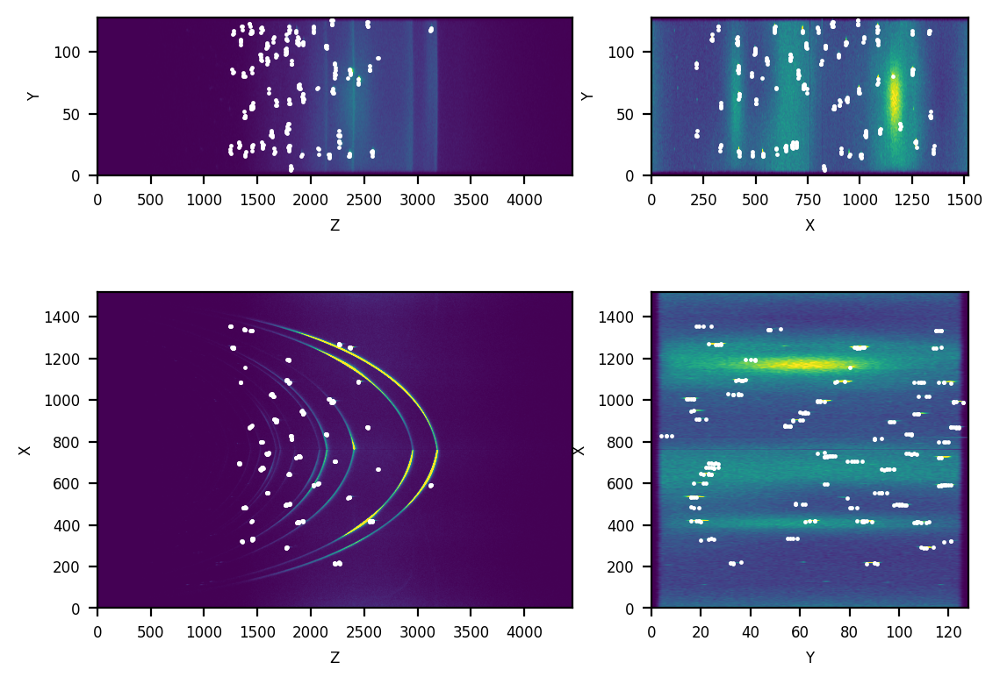

# bragg-detect

`bragg-detect` is python library to detect Bragg peaks in 3D X-ray/neutron images.


## Quick Start

To install `bragg-detect`:

```bash
pip install https://github.com/stfc-sciml/bragg-detect/archive/refs/heads/main.zip
```

`bragg-detect` only has one user API:

```python
def detect_bragg_peaks(data,
                       # slicing
                       large_peak_size, detect_block_size=5,
                       detect_block_overlap=2, verify_block_size=10,
                       # 2d blobs by LoG
                       min_sigma=None, max_sigma=None, num_sigma=5,
                       threshold=.2, overlap=.5, log_scale=False,
                       # 3d peak selection
                       strategy_3d='individual', n_components_bgm=5,
                       n_init_bgm=1,
                       # others
                       workers=1, verbose=True):
    """
    Detect Bragg peaks.

    :param data: the 3D data as a numpy.ndarray or a tuple
        (filename, dsetname) to specify a HDF5 dataset storing the 3D data;
        when using multiple works, use (filename, dsetname) for both better
        performance and less memory consumption
    :param large_peak_size: approximate size of the large peaks in data,
        array-like in the form of (size_x, size_y, size_z);
    :param detect_block_size: size of the detection blocks relative to
        `large_peak_size`; default is 5
    :param detect_block_overlap: overlap of the detection blocks
        relative to `large_peak_size`; default is 2
    :param verify_block_size: size of the verification blocks relative
        to `large_peak_size`; default is 10
    :param min_sigma: min_sigma for blob_log() of scikit-image;
        default is None, or large_peak_size // 4
    :param max_sigma: max_sigma for blob_log() of scikit-image;
        default is None, or large_peak_size
    :param num_sigma: num_sigma for blob_log() of scikit-image;
        default is 5
    :param threshold: threshold for blob_log() of scikit-image;
        default is 0.2
    :param overlap: overlap for blob_log() of scikit-image;
        default is 0.5
    :param log_scale: log_scale for blob_log() of scikit-image;
        default is False
    :param strategy_3d: strategy for 3d morphological analysis; can be
        `individual` or `bgm_clustering`; default is `individual`
    :param n_components_bgm: n_components for BayesianGaussianMixture() of
        scikit-learn, used only for `bgm_clustering` strategy; default is 5
    :param n_init_bgm: n_init for BayesianGaussianMixture() of
        scikit-learn, used only for `bgm_clustering` strategy; default is 1
    :param workers: number of workers; default is 1
    :param verbose: verbose info during running; default is True
    :return: detected Bragg peaks
    """
```

See [example/example.py](example/example.py) to learn the usage. 
The 3D data has a shape of `(1520, 128, 4451)`. The following two figures
show respectively the input 3D data and the detected Bragg peaks.


* Input 3D data summed over the three dimensions


* Detected Bragg peaks over the input data



## Credits
Kuangdai Leng<sup>1</sup>, Pascal Manuel<sup>2</sup>, Jos Cooper<sup>2</sup>, Jeyan Thiyagalingam<sup>1</sup>

<sup>1</sup> Scientific Computing Department, STFC, UK

<sup>2</sup> ISIS Neutron and Muon Source, STFC, UK

We thank Samuel Jackson<sup>1</sup> and Anders Markvardsen<sup>2</sup> for their 
investigations in [an earlier project](https://github.com/ISISScientificComputing/ml-peak-finding) 
that have facilitated our understanding of the problem.

## Funding and Support 
This work was supported by the ISIS Neutron and Muon Source (ISIS) of the Science and Technology Facilities Council through the ISIS-ML funding, and by Wave I of the UKRI Strategic Priorities Fund under the EPSRC grant (EP/T001569/1), particularly the AI for Science theme in that grant and the Alan Turing Institute. We gratefully acknowledge their support.
